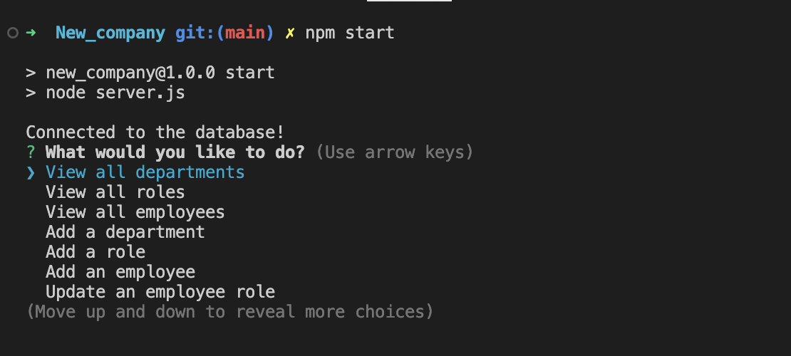
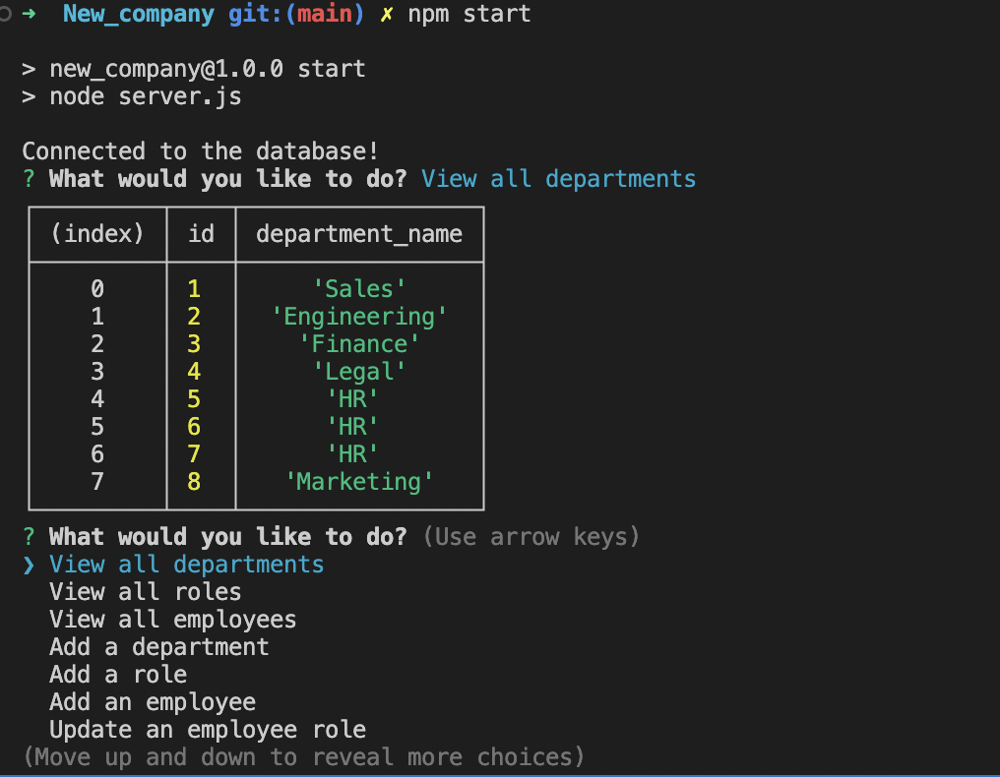
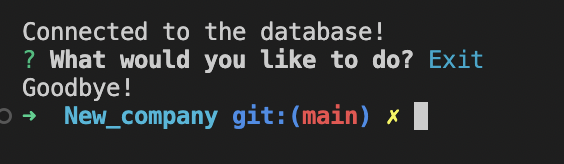

# New_company

## User Story

```md
AS A business owner
I WANT to be able to view and manage the departments, roles, and employees in my company
SO THAT I can organize and plan my business
```

## Acceptance Criteria

```md
GIVEN a command-line application that accepts user input
WHEN I start the application
THEN I am presented with the following options: view all departments, view all roles, view all employees, add a department, add a role, add an employee, and update an employee role
WHEN I choose to view all departments
THEN I am presented with a formatted table showing department names and department ids
WHEN I choose to view all roles
THEN I am presented with the job title, role id, the department that role belongs to, and the salary for that role
WHEN I choose to view all employees
THEN I am presented with a formatted table showing employee data, including employee ids, first names, last names, job titles, departments, salaries, and managers that the employees report to
WHEN I choose to add a department
THEN I am prompted to enter the name of the department and that department is added to the database
WHEN I choose to add a role
THEN I am prompted to enter the name, salary, and department for the role and that role is added to the database
WHEN I choose to add an employee
THEN I am prompted to enter the employee’s first name, last name, role, and manager, and that employee is added to the database
WHEN I choose to update an employee role
THEN I am prompted to select an employee to update and their new role and this information is updated in the database 
```
## Getting Started

You will first need to do NPM init -y to get started with downlaoding the dependencies. After which you will enter npm i mysql and npm i inquirer but verison 8 so it will load. After which you will go into your package.json and go under scripts to take somethings. Starting with having 'Start': "node server.js" so it will load the inquirer and have the actual prompts appear. But before you can do that you will need to run mySQl and source the schema and then exit and NPM run seed to get the data loaded. After that npm start and begin. Thanks!

## ScreenShots

When you start it up by typing 'npm start'



When you click on  view departments



When you click the exit!



## Link to Video Demo

https://drive.google.com/file/d/1At4iU6PtSA0ymQHOqELzlv9VTj49UA5N/view